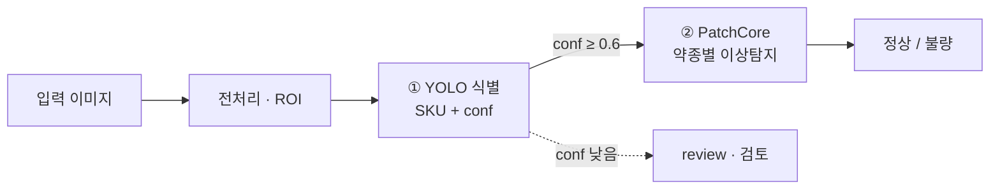

# 경구 정제 알약 불량 탐지 (Oral Tablet Defect Detection)

> 알약 사진 한 장으로 **약종 식별 → 정상/불량 판정**. YOLO + PatchCore 2단계 캐스케이드 · Firebase 파이프라인.

---

## 1. 목적

- 경구 알약 품질 검사 자동화. 수작업 검사의 속도·일관성 한계 해결.
- 불량 샘플은 희소 → **정상만으로 학습**하는 이상탐지로 접근.
- 핵심 질문: *정상만 학습해도 불량을 잡을 수 있는가?* → **검증됨** (평균 AUROC 0.982).

## 2. 태스크

| 단계 | 모델 | 역할 |
|---|---|---|
| ① 식별 | YOLO11n (detection) | 알약 위치 + **약종(SKU)** 분류 |
| ② 판정 | PatchCore (약종별) | 해당 약종의 **정상/불량 이상탐지** |

## 3. 아키텍처



서빙: **Flutter 앱 → Firebase(Storage·Firestore 큐) → 서버 워커(추론) → Firestore 결과 → 앱 구독**(비동기).

## 4. 데이터

데이터 source : AIHUB 경구약제 이미지 데이터 (경구약제 4024종)
https://aihub.or.kr/aihubdata/data/view.do?currMenu=115&topMenu=100&aihubDataSe=data&dataSetSn=576

### 경구정제 2972종 중 중 총 200종의 정제 선정 기준
**1) 데이터 범위**
- Training 데이터만 사용
- 경구 정제(Tablet)만 사용
- 1 약품 = 1 클래스
- 각 약품당 정상 이미지 100장 사용
  - 앞면 50장
  - 뒷면 50장

**2) 정제 모양 다양성 확보**
- 실제 환경에서 다양한 형태의 정제를 식별할 수 있도록 모양 분포를 고려하여 선정
- 포함 모양:
	원형, 타원형, 장방형, 삼각형, 사각형, 오각형, 육각형, 팔각형, 마름모형, 반원형, 기타
- 특히 데이터 수가 적은 마름모형, 반원형 등 희소 형태는 전부 포함

**3) 색상 다양성 확보**
- 2색 정제는 데이터 수가 적고 식별 특성이 뚜렷하므로 우선적으로 포함
  - 2색 정제 36종 전부 포함
  - 단색 정제와 함께 구성하여 색상 다양성 확보

**4) 분할선 특성 반영**
- 정제 식별에 영향을 줄 수 있는 분할선 특성을 반영하기 위해 분할선이 있는 정제와 없는 정제를 모두 포함
  - has_line = True
  - has_line = False
- 정제가 다양한 외형 특성을 갖도록 구성

**5) 각인(식별문자)**
- 초기에는 각인 유무를 동일 비율로 맞추는 방안을 검토하였으나, 실제 데이터 분포상 각인이 없는 정제가 매우 적어 최종 선정 기준에서는 제외
- 대신 실제 데이터 분포를 유지하면서 모양과 색상 다양성을 우선 고려

 **6) 최종 이미지 추출**
- 선정된 200종 정제에 대해 앞면 이미지 50장, 뒷면 이미지 50장을 무작위 추출하여 약품당 총 100장의 정상 이미지를 확보


| 항목 | 값 |
|---|---|
| 약종(SKU) | **200종** |
| 약종당 | 124장 = 정상 100 + 합성 불량 24 |
| 전체 | 24,800장 (정상 20,000 + 불량 4,800) |
| 불량 유형 | blur · chip · contamination · crack · dent · discoloration |
| 분석 대상 불량 | 5종 4,000장 (**blur = 촬영 아티팩트로 제외**) |
| ROI | 약 위치 bbox 제공 |

## 5. 모델

- **YOLO11n** — imgsz 640, 50 epochs, 200클래스 파인튜닝. 검출 + 분류 동시.
- **PatchCore** — WideResNet50-2(동결) layer2+3, ROI 크롭, coreset 0.04, 임계값 정상 p99. **불량 라벨 불필요**.

## 6. 결과 (200종, blur 제외)

| 지표 | 값 |
|---|---|
| YOLO 약종 식별 | **99.96%** (23,991 / 24,000) |
| PatchCore 평균 AUROC | **0.982** (173/200종 ≥ 0.95) |
| 불량 탐지율 (Recall) | **94.8%** (3,793 / 4,000) |
| 정상 오탐 (FPR) | 5.0% |

<p align="center">
  
  &nbsp;
  
</p>

> 형태 결함(균열·깨짐·눌림·오염) 99%+ 탐지. 히트맵이 실제 손상 위치를 활성화.
> 전체 리포트 → [`output/eval200/FINAL_REPORT.html`](output/eval200/FINAL_REPORT.html)

## 7. 한계

- **변색** 탐지율 75.5% — 색 변화가 약해 임계값에 걸침. 임계값 인하는 FPR 폭증으로 부적합 → 색 특징·조명 불변으로 개선.
- **도메인 갭** — 스튜디오 학습 → 통제 안 된 실환경에서 식별 저하. 검출은 일반화, 분류는 도메인 적응 필요.
- 합성 불량 기반 검증 — 실제 불량 데이터로 교차검증 필요.

## 8. 리포지토리 구성

```
app/                                  Flutter 앱 (촬영·업로드·결과)
firebase/                             보안 규칙 · 데이터 계약
server/                               추론 워커 (전처리·식별·판정)
HumanAI_Pill_Defect_Detection/HumanAI_Pill_Defect_Detection/
  training/                           학습·평가 (YOLO · PatchCore)
  gcp/                                GCP 실행 스크립트
  infer.py · drug_names.json          단일 이미지 추론 + 약품명 매핑
model/
  all_pills/                          YOLO 학습 산출물 (best.pt)
  patchcore_200/                      200 SKU 메모리뱅크 (.npz)
output/eval200/                       리포트 · 지표 · 그림 (FINAL_REPORT.html)
```

## 9. 실행

```bash
# 추론 (단일 이미지)
cd HumanAI_Pill_Defect_Detection && python infer.py <image.jpg>

# 서버 빠른 검증 (mock · Firebase·모델 불필요)
cd server && python -m pytest tests/ -v

# 서버 실제 구동 (모델 산출물 + 서비스계정 후)
cd server && cp .env.example .env && docker compose up --build
```

- 학습·평가 → [`training/README.md`](HumanAI_Pill_Defect_Detection/HumanAI_Pill_Defect_Detection/training/README.md)
- GCP 200종 평가 → [`gcp/README_GCP.md`](HumanAI_Pill_Defect_Detection/HumanAI_Pill_Defect_Detection/gcp/README_GCP.md)
- 가이드 → [`SINGLE_SKU_GUIDE.html`](HumanAI_Pill_Defect_Detection/HumanAI_Pill_Defect_Detection/SINGLE_SKU_GUIDE.html) · [`INFERENCE_GUIDE.html`](HumanAI_Pill_Defect_Detection/HumanAI_Pill_Defect_Detection/INFERENCE_GUIDE.html)

## 10. 팀

주예진 · 박종범 · 박재준
